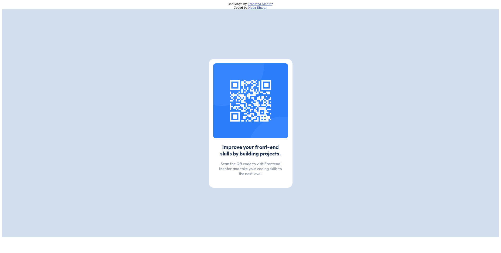

# Frontend Mentor - QR code component solution

This is a solution to the [QR code component challenge on Frontend Mentor](https://www.frontendmentor.io/challenges/qr-code-component-iux_sIO_H). Frontend Mentor challenges help you improve your coding skills by building realistic projects. 

## Table of contents

- [Overview](#overview)
  - [Screenshot](#screenshot)
  - [Links](#links)
- [My process](#my-process)
  - [Built with](#built-with)
  - [What I learned](#what-i-learned)
  - [Continued development](#continued-development)
  - [Useful resources](#useful-resources)
- [Author](#author)

## Overview

### Screenshot

### Links

- Solution URL: [Add solution URL here](https://your-solution-url.com)
- Live Site URL: [Add live site URL here](https://your-live-site-url.com)

## My process

### Built with

- Semantic HTML5 markup
- CSS custom properties
- Flexbox
- Firefox Dev Tools

### What I learned

Emulators are valuable, especially when UI testing. I haven't used one for this challenge, but one of the main challenges I ran into is simulating a max.-width screen of 375px on my desktop to test the responsiveness of my styling. Also, dev. tools in Firefox, especially the rulers, are a wonderful asset when creating pixel-perfect components based on design mockups.

### Continued development

I want to explore the use of mobile emulators for UI prototyping some more (hopefully, they're not computationally expensive :D ).

### Useful resources

- [A Complete Guide to Flexbox](https://css-tricks.com/snippets/css/a-guide-to-flexbox/) - I often forget flexbox style attributes and I use this regularly as a ref. I love the visual aspect. Not only are the illusstrations easy to grasp but you can quickly sift through the attributes to find the one you need based on them.
- [Google Fonts](https://fonts.google.com/) - An amazing collection of fonts from which you can select the font family and weights. Part of the website is a tool that generates either the HTML or the CSS import code of the font(s) selected. Together with the ability to select more than one font or weight, the tool provides a one-line solution to easily import what you're interested in without dealing with the hassle of specifying several imports.

## Author

- Website - [Nada Elnour](https://nelnour.github.io)
- Frontend Mentor - [@NElnour](https://www.frontendmentor.io/profile/NElnour)

